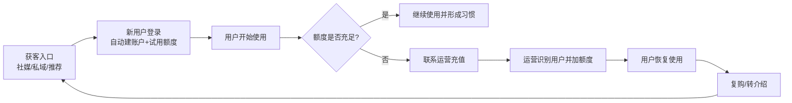
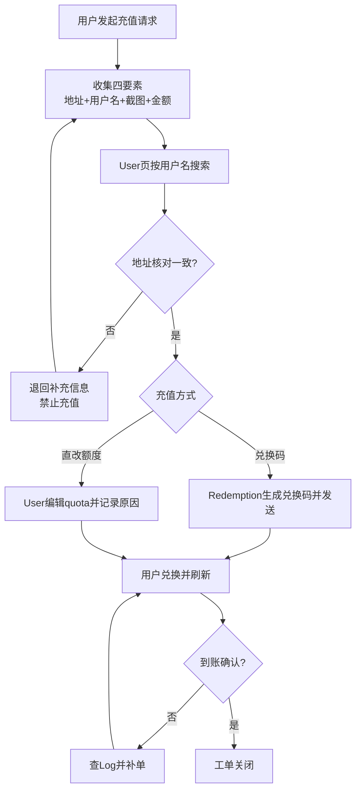
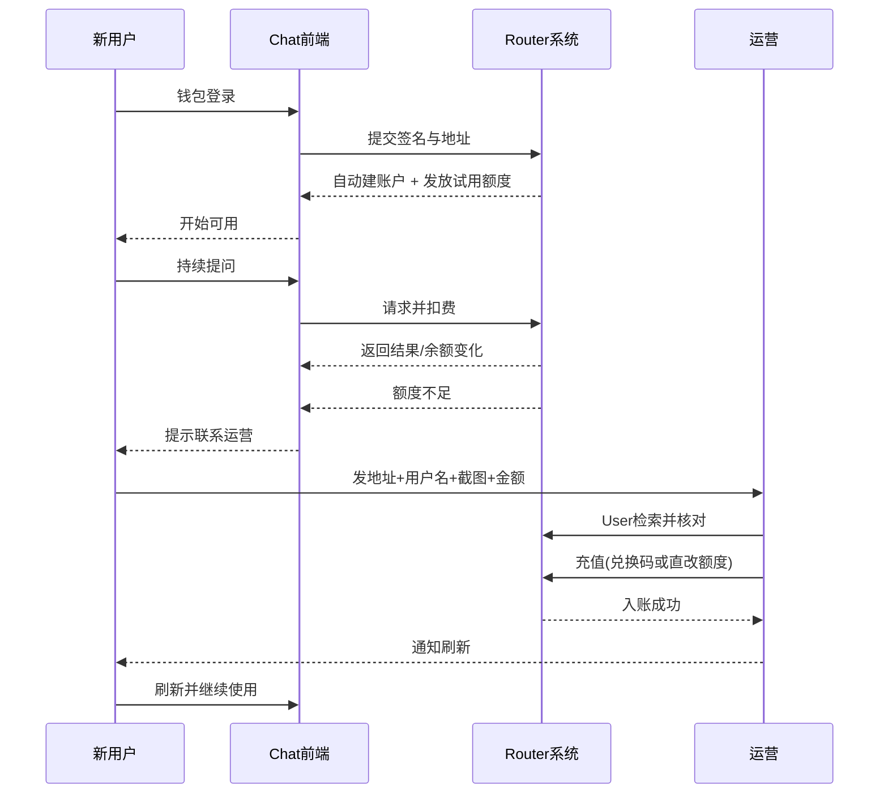

# Router 运营说明书（小白版）

> 站点：`https://router.yeying.pub/`  
> 文档定位：给“非技术运营”一条可执行主线，不是功能堆砌。  
> 校验方式：已用管理员账号实测关键接口与真实数据结构（2026-02-21）。

---

## 0. 先记住一句话（运营主线）

**获客 -> 让用户顺利试用 -> 在额度用完前后完成充值转化 -> 保证可用性 -> 复购。**

你每天做的所有配置，都应该服务这条主线。

---

## 1. 你在后台最常用的 6 个页面（按频率）

1. `Dashboard`：先看总趋势（请求量/花费/活跃）。
2. `Channel`：保证“能用、稳定、不超成本”。
3. `User`：处理用户状态、额度、分组。
4. `Redemption`：发兑换码，做拉新/补偿/充值闭环。
5. `Log`：查问题、查扣费、查异常。
6. `Setting -> Operation/System`：调全局策略（新用户额度、倍率、登录注册、公告）。

---

## 2. 新用户从登录到充值：运营怎么接住

## 2.1 用户发生了什么（你要理解的真实过程）

- 用户首次钱包登录后，系统自动创建用户。
- 用户会拿到试用额度（当前线上配置对应约 1 美元）。
- 用户用着用着额度耗尽，会来找运营充值。

线上实测关键点：
- `QuotaForNewUser = 500000`
- `QuotaPerUnit = 500000`
- `DisplayInCurrencyEnabled = true`

因此在当前配置下，**500000 quota ~= 1 美元显示额度**。

## 2.2 自动建的用户长什么样（重点）

实测用户记录形态：
- `username`: `wallet_xxxxxx`（自动生成）
- `wallet_address`: `0x...`（真实身份）
- `group`: 默认 `default`
- `quota/used_quota/request_count`: 可直接看到

结论：
- **系统主身份是 `wallet_address`**。
- 但运营日常检索时，**通常先靠 `username=wallet_xxxxxx` 更快定位**。

---

## 3. “用户来充值”标准SOP（非技术可直接照做）

## 3.1 让用户一次性给全材料

让用户发这 4 件：
1. 钱包地址（完整 `0x...`）
2. 用户名（如 `wallet_oHC1Jk`）
3. 额度不足截图
4. 充值金额/套餐意向

> 为什么同时要“地址+用户名”：
> 当前线上实测里，后台搜索对 `username` 更稳定，地址用于二次核对防充错。

## 3.2 后台操作顺序

1. 进入 `User` 页面，先按 `username` 搜索。
2. 打开用户详情，核对 `wallet_address` 是否一致。
3. 选择充值方式（推荐优先级）：
   - **方式A（推荐）**：发兑换码（`Redemption`）给用户自助兑换。
   - **方式B（应急）**：直接改用户 `quota`（需记录原因）。
4. 操作后让用户刷新并回传“到账截图”。
5. 在 `Log` 留痕核验。

---

## 4. 你每天的“运营值班主线”（30分钟版）

## 4.1 第一步：看板判定今天是否“健康”

看 `Dashboard`：
- 请求是否突然下降（可能渠道挂了）
- 花费是否异常上升（可能倍率或模型路由有问题）

## 4.2 第二步：渠道健康巡检（最关键）

看 `Channel`：
- `status`：是否有关键渠道被禁用
- `response_time`：是否明显变慢
- `models`：核心模型是否还在

高频动作：
- 测试渠道（单个/批量）
- 禁用故障渠道
- 调整 `priority/weight`
- 更新余额（如对接第三方余额型通道）

## 4.3 第三步：用户侧问题闭环

看 `User` + `Log`：
- 有无高频报错用户
- 是否是额度不足、模型无权限、渠道故障导致

输出给用户的话术要简单：
- 是额度问题：给充值路径
- 是渠道问题：给预计恢复时间
- 是模型权限问题：告知可用模型清单

---

## 5. 为获客必须会的配置（只讲真正影响转化的）

## 5.1 `Setting -> System`（入口与信任）

重点项：
- `PasswordLoginEnabled` / `RegisterEnabled`
- `Notice`（公告）
- `TopUpLink`（充值引导）
- `ChatLink`（聊天入口）
- `SystemName` / `Logo`

作用：用户是否能进来、看懂、愿意付费。

## 5.2 `Setting -> Operation`（成本与利润）

重点项：
- `QuotaForNewUser`（试用门槛）
- `QuotaPerUnit`（额度与货币换算）
- `ModelRatio` / `CompletionRatio` / `GroupRatio`（定价核心）
- `RetryTimes`（成功率 vs 成本）
- `AutomaticDisableChannelEnabled` / `ChannelDisableThreshold`（稳定性）

原则：
- 一次只改一组参数。
- 每次改完观察一个完整周期再下结论。
- 任何改动都要写“改前值/改后值/预期/回滚条件”。

---

## 6. 运营视角的完整业务时序（用户 + 运营 + 系统）

---

## 7. 小白最容易踩的 8 个坑（直接避雷）

1. 只看昵称就充值 -> 易充错人。  
2. 用户只给“地址后四位” -> 绝对不够。  
3. 不看日志就判断系统坏了 -> 误判多。  
4. 同时改多个配置 -> 出问题无法回滚。  
5. 渠道慢但不测 -> 用户体感先崩。  
6. 不设置充值入口文案 -> 用户流失在最后一步。  
7. 不做到账确认 -> 纠纷率上升。  
8. 用 root 做日常多人协同 -> 风险极高（应建立子管理员）。

---

## 8. 给运营的“每日最小执行清单”

- 09:00 看 `Dashboard`（5分钟）
- 09:05 看 `Channel` 健康（10分钟）
- 09:15 处理充值与用户工单（10分钟）
- 09:25 看 `Log` 做异常闭环（5分钟）
- 每次策略变更：记录变更日志（必须）

---

## 9. 本文结论（给老板/团队的一句话）

**Router 的运营不是“调参数”，而是把“识别用户 -> 保障可用 -> 完成转化 -> 持续复购”做成可重复执行的闭环。**
